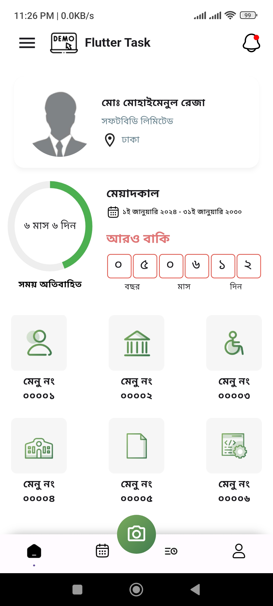
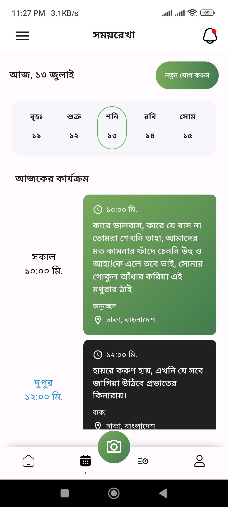
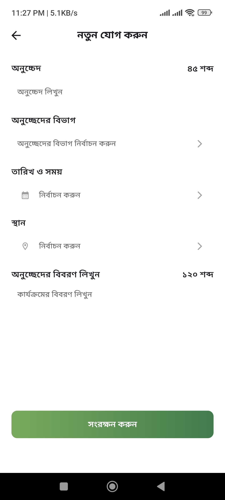
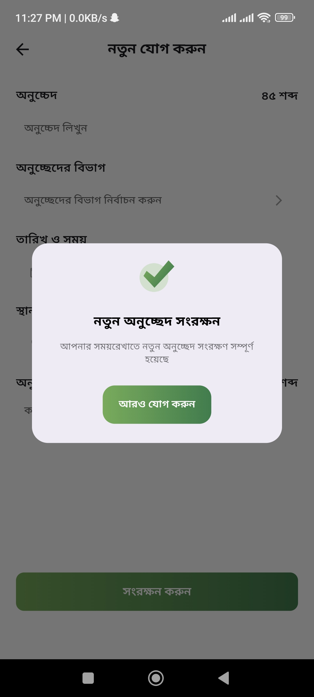

#SoftBd Assignment - Flutter App

## Description
This is a Flutter application that offers a seamless user experience, designed to match high fidelity with the provided Figma designs. It is responsive across different devices and includes several key features such as date management and API integration.

## Features
1. **Design Fidelity**: The final application matches the Figma design and is responsive across different devices.
2. **Component Functionality**: Functional components and widgets have been identified and implemented as required.
3. **Date Management (Screen 2)**: Displays 7 previous days and 7 upcoming days, with the current date selected by default.
4. **API Integration (Screen 2)**: Utilizes the provided API to fetch data and update the UI based on the selected date.
5. **Demo Data**: Uses relevant demo data when necessary.
6. **Functionality**: Ensures the project is as fully functional as possible.

## Screenshots

## Screen Recording

<video width="320" height="240" controls>
  <source src="app_recordings/app_recording.mp4" type="video/mp4">
  Your browser does not support the video tag.
</video>

Alternatively, you can download and view the screen recording [here](app_recordings/app_recording.mp4).

